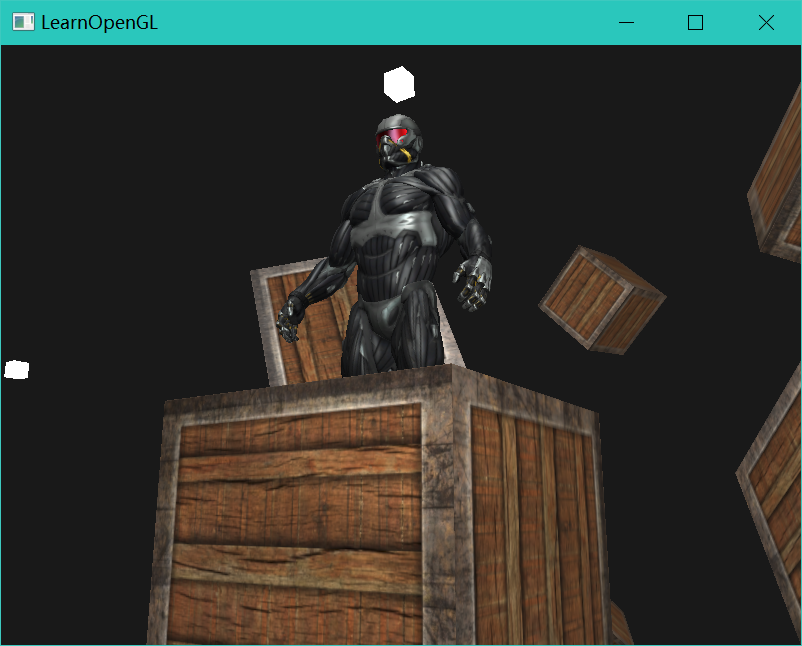
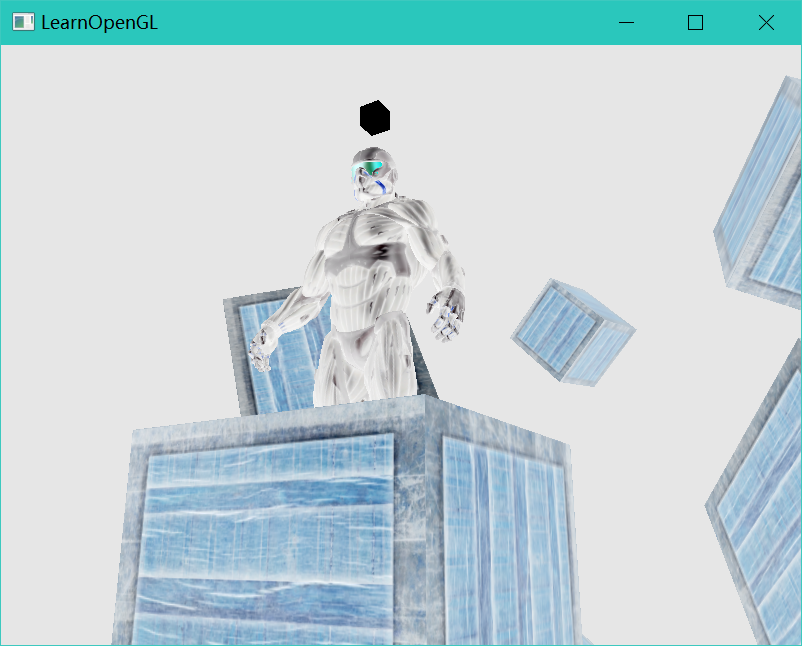
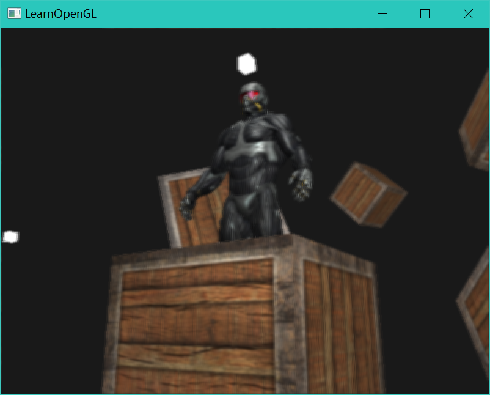
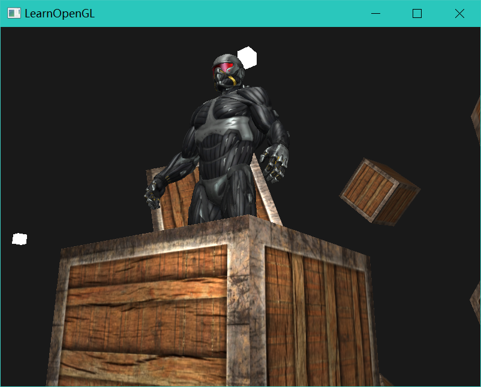

## OpenGL学习记录工程

记录下目前OpenGL的学习进度，克服拖延症:)

目前已经实现的功能：

1. 着色器类
2. 纹理类
3. 摄像机
4. 基础光照（Ambient&Diffuse&Specular）&材质
5. 光照贴图
6. 多光源，点光源，聚光灯
7. 模型类
8. 深度测试&模板测试&混合
9. 帧缓冲
10. Gamma矫正

ToDo:

1. GPU Instance
2. 延迟渲染
3. PBR
4. 光线追踪
5. ...

看起来是这样的:

反相:

Kernel-Blur

Gamma矫正：

